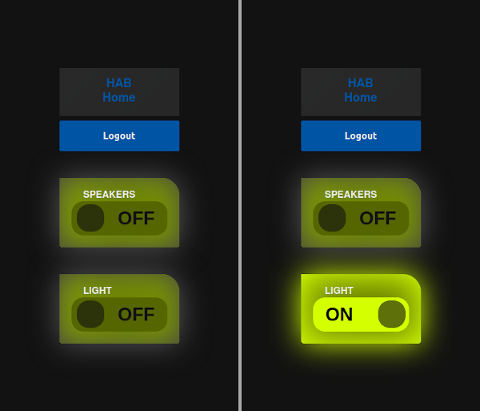

# home-automation-basic
This is basic home automation web application meant to run on the raspberry pi using the Wildfly server for the purpose of controlling the Raspberry Pi GPIO pins.
  
This web app is used to turn on and off relays via GPIO. Relay setup details coming soon.
